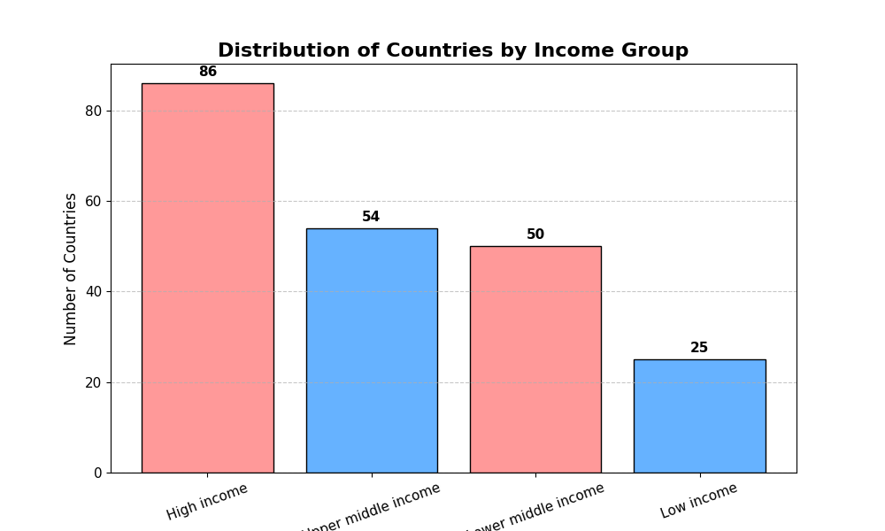
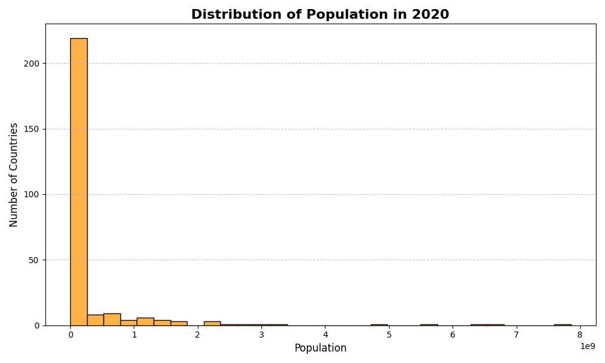

# Task-01: Data Visualization (Prodigy InfoTech Internship)

## 📌 Project Overview
This project is part of my Data Science internship with **Prodigy InfoTech**.  
The task demonstrates data visualization skills using Python, pandas, and matplotlib.

The goal was to:
- Create a **bar chart** to visualize the distribution of a categorical variable.
- Create a **histogram** to visualize the distribution of a continuous variable.

---

## 📂 Dataset
The dataset is sourced from the **World Bank** and provided by Prodigy InfoTech:
- `API_SP.POP.TOTL_DS2_en_csv_v2_3.csv` → Population data (1960–2020).
- `Metadata_Country_API_SP.POP.TOTL.csv` → Country metadata (Region, IncomeGroup).

---

## 📊 Visualizations

### 1. Bar Chart: Distribution of Countries by Income Group
This chart shows how countries are categorized into income groups:
- Low Income  
- Lower Middle Income  
- Upper Middle Income  
- High Income  

---

### 2. Histogram: Distribution of Population in 2020
This histogram shows the spread of population sizes across countries in the year 2020.

---

## 🛠️ Tools & Libraries
- **Python 3**
- **pandas** (data handling)
- **matplotlib** (visualization)
- **VS Code** (development environment)
- **Git & GitHub** (version control)

